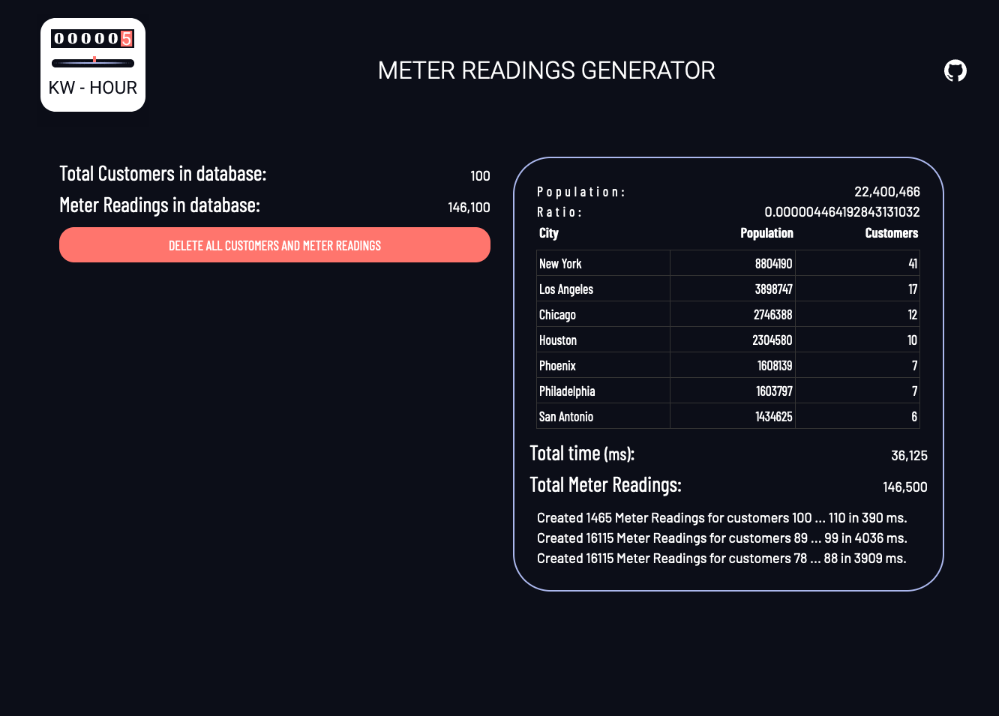

# MeterReadings
 Proyecto en PHP y vue.js que genera clientes y mediciones aleatorias para simular consumos eléctricos.

## Getting started
Necistarás un servidor de php y mysql. (ejemplo XAMP or MAMP)

### Ejecutar consultas sql
Hay unas consultas iniciales para ejecutar desde phpMyAdmin o MySQLWorkBench importa el archivo database/meterreadings.sql En una nueva base de datos, este archivo crea la tablas necesarias así como la tabla de ciudades nombres y apellidos para generar los datos aleatorios.

### Configurar la base de datos

En connection.php debes reemplazar con tus datos: 
```
$dbhost,$dbuser,$dbpassword y $db 
```

```
<?php
$dbhost="localhost";  // host  MySQL (localhost)
$dbuser="root";
$dbpassword="root"; 
$db="meterreadings"; 
  
$connection = mysqli_connect($dbhost, $dbuser, $dbpassword,$db);
```

# Ejecutar el generador
Abre el archivo index.html desde tu servidor local
Ejemplo: http://localhost/meter-readings-generator/index.html

# Generar los clientes y las mediciones:
1. Generar los clientes, hay que indicar el numero de clientes y las ciudades a usar
    Los clientes se generán desde las tablas de nombres y apellidos.
    Las ciudades contienen la población que es usada para calcular el número de clientes por cada ciudad.
    Los clientes tiene una vivienda en la que se calculan también de forma aleatoria los metros cuadrados, que después se usarán para calcular el consumo.
    
2. Generar lecturas.
    Selecciona los años y el tipo de medición: 
    Monthly: 1 lectura por mes.
    Daily: 1 lectura por día.
    Puedes ver cuantas lecturas se van a crear en la base de datos
    
3. Datos generados:
    

4. Borrar los datos
Si en la base de datos hay información, aparecerá un botón para borrarlos.

