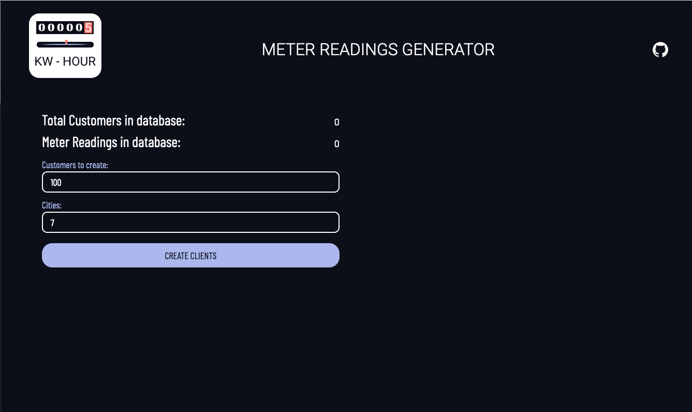
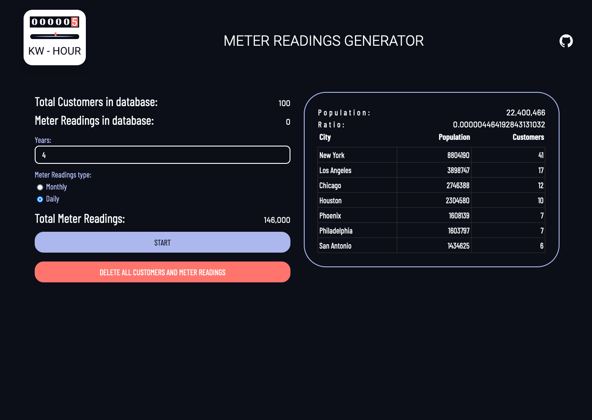
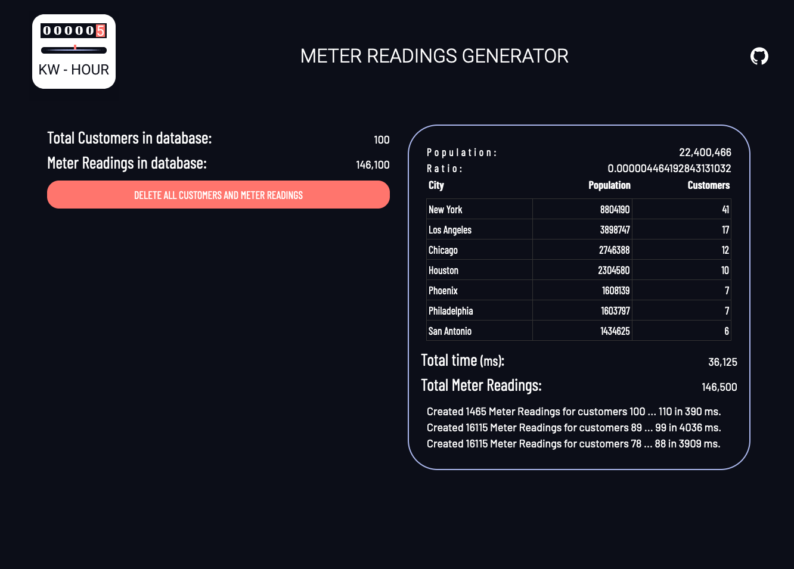

[Español README](README.es.md)

# MeterReadings
PHP and Vue.js project to generate ramdom customers and meter readings to simulate electricity consumption.

## Getting started
You need a php and a mysql server. (example XAMP or MAMP)

### Execute sql querys
Initial sql querys are required.
From phpMyAdmin or MySQLWorkBench import de file database/meterreadings.sql in a new database, this file create tables tcities, tname and tlastname to make ramdom customers.

### Config database

on connection.php replace 
```
$dbhost,$dbuser,$dbpassword and $db with your own data
```

```
<?php
$dbhost="localhost";  // host  MySQL (localhost)
$dbuser="root";
$dbpassword="root"; 
$db="meterreadings"; 
  
$connection = mysqli_connect($dbhost, $dbuser, $dbpassword,$db);
```
# Execute generator
Open file index.html from your local server
Example: http://localhost/meter-readings-generator/index.html

# Generate customers an meter readings
1. Generate customers, select number of customer and number of cities.
    Customers will be generate from names and last names 
    cities contains population and is used to make customers in a city with a ratio
    customer is located in a living place with a random square meters who is used to calculate KWh
    
2. Generate Meter readings.
    Select years and type of meter readings: 
    Monthly: 1 reading per month.
    Daily: 1 reading per day.
    You can see how many meter readings will be generate
    
3. Data generated:
    

4. Deleting data
If there is data in the database, a button will appear to be able to delete it.

